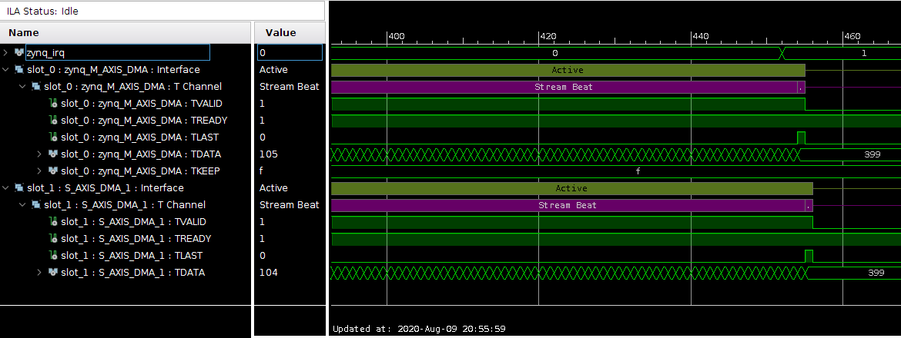
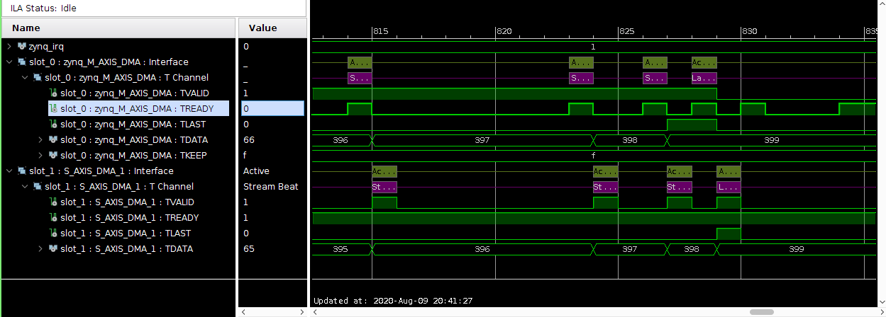

# Vivado Tester for skidbuffer LFSR

Skidbuffer with LFSR is a design that inserts pseudo random timing interruptions in a AXI streaming data flow. This is usefull test the AXIS interfaces of new blocks. 
This repo is a project demonstrating how skidbuffer LFSR in a Zynq DMA transfer.
The project is setup for Zedboard, although it would be easy to change to other boards assuming you have some basic TCL skills.

# Module/IP design

Here is an example were 400 intergers are sent via DMA. Normally you dont see any contention.



However, without contention it is not possible to really test an AXIS interface. 
Skidbuffer + LFSR inserts these short contentions in the dataflow, testing the interface protocol of a block with AXIS. This is what happens to the same data transfer after Skidbuffer + LFSR  block.



# How to download it

This repository might have custom IPs included as git submodules. Thus, the following command is required to download all its dependencies.

```
git clone --recursive https://github.com/amamory/<repo-name>.git
```

If you already cloned the repository without `--recursive`, then run the following command to download all the submodules.

```
git submodule update --init --recursive
```

Refer to this [tutorial](https://www.vogella.com/tutorials/GitSubmodules/article.html) to learn how to manage submodules.


# How to run it

These scripts are assuming Linux operation system (Ubuntu 18.04) and Vivado 2018.2.

Follow these instructions to recreate the Vivado and SDK projects:
 - Open the **build.sh** script and edit the first lines to setup these environment variables:
    - **VIVADO**: path to the Vivado install dir;
    - **VIVADO_DESIGN_NAME**: mandatory name of the design;
    - **XIL_APP_NAME**: used only in projects with software;
    - **VIVADO_TOP_NAME**: set the top name (optional).  
 - run *build.sh*

These scripts will recreate the entire Vivado project, compile the design, generate the bitstream, export the hardware to SDK, create the SDK projects, import the source files, build all projects, and finally download both the bitstream and the elf application. Hopefully, all these steps will be executed automatically.

# How to update the scripts

These scripts come from a template repository and they get updated and improved over time. If you wish to get the latest script version, then follow these steps:

```
git remote add template https://github.com/amamory/vivado-base-project.git
git fetch --all
git merge --no-commit --no-ff template/master --allow-unrelated-histories
```

Solve any conflict manually and then commit.

# Future work

 - update the scripts to Vitis
 - support or test with Windows (help required !!! :D )

# Credits

The scripts are based on the excellent scripts from [fpgadesigner](https://github.com/fpgadeveloper/zedboard-axi-dma) plus few increments from my own such as project generalization, support to SDK project creation and compilation and other minor improvements. 
